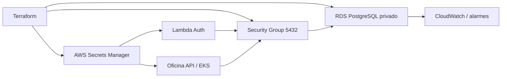

# Oficina Database Infrastructure

Infraestrutura Terraform independente do Amazon RDS for PostgreSQL, incluindo rede de acesso, credenciais, backups e monitoramento.

## Arquitetura



Relacionados: [API](https://github.com/maypinheiro/oficina-api), [autenticação](https://github.com/maypinheiro/oficina-auth-function) e [Kubernetes](https://github.com/maypinheiro/oficina-k8s-infra).

## Tecnologias

Terraform, Amazon RDS PostgreSQL, DB Subnet Group, Security Groups, Secrets Manager, CloudWatch, Performance Insights, S3/DynamoDB para state e GitHub Actions.

## Pré-requisitos

- Terraform 1.6+ e AWS CLI;
- VPC, sub-redes privadas e security groups de EKS/Lambda;
- sessão ativa da conta Academy `982623100545`.

## Execução local e validação

Este repositório provisiona cloud; localmente executa somente validação:

```bash
terraform fmt -check -recursive
terraform init -backend=false
terraform validate
```

Para um plan real, copie o exemplo do ambiente, preencha IDs não sensíveis e configure as credenciais temporárias fora do Git.

## Variáveis e secrets

Exemplos: `environments/hml.tfvars.example` e `prod.tfvars.example`. O CD requer `AWS_ACCESS_KEY_ID`, `AWS_SECRET_ACCESS_KEY`, `AWS_SESSION_TOKEN`, `TF_STATE_BUCKET`, `TF_STATE_LOCK_TABLE`, `VPC_ID`, `PRIVATE_SUBNET_IDS_JSON`, `DATABASE_CALLER_SECURITY_GROUP_IDS_JSON` e `RDS_CA_PEM`.

## Ambientes

- `hml`: Single-AZ, dados sintéticos, backup por 1 dia;
- `prod`: instância independente, backup por 7 dias, proteção contra exclusão e snapshot final;
- Multi-AZ permanece evolução condicionada ao orçamento acadêmico.

## CI/CD e deploy

CI executa `terraform fmt`, init sem backend, validate, tfsec e SonarCloud. CD manual usa GitHub Environment `hml` ou `prod`, backend remoto criptografado, plan e apply. Provisionar depois da rede/EKS e antes das Functions/API.

## Rollback e migrations

Infraestrutura é corrigida por novo plan revisado; nunca editar state ou apagar banco como rollback. Antes de mudança destrutiva, gerar snapshot. Migrations são executadas pelo Job Kubernetes da API e seguem [migrations](docs/migrations.md); rollback de imagem não reverte schema.

## Outputs

Endpoint, porta, nome do banco, ARN do secret e security group são publicados para os pipelines consumidores. Senha e conteúdo do secret nunca são outputs abertos.

## Observabilidade

CloudWatch, logs PostgreSQL, Performance Insights e alarmes acompanham CPU, storage livre e conexões. Datadog consome os sinais conforme a infraestrutura de observabilidade.

## Ambiente ativo e limitações

Banco ativo: **não publicado nesta etapa**. Classes, RDS, Secrets Manager, Performance Insights e IAM precisam ser validados em uma sessão real do Learner Lab. O state e o bundle CA são sensíveis e não são versionados.
