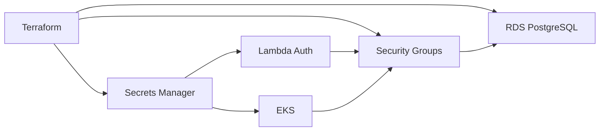

# Oficina Database Infrastructure

Infraestrutura Terraform independente para o Amazon RDS for PostgreSQL.

## Responsabilidades

- DB subnet group em sub-redes privadas;
- RDS PostgreSQL por ambiente;
- Security Group aceitando 5432 apenas de EKS e Lambda;
- criptografia, backup, retenção e proteção contra exclusão;
- credenciais no AWS Secrets Manager;
- outputs não sensíveis para integração;
- alarmes operacionais e tags de custo.

## Ambientes

- ambos ficam na conta AWS Academy Learner Lab `982623100545`;
- `homolog`: Single-AZ, dados sintéticos e retenção reduzida;
- `production`: instância e backups independentes, proteção contra exclusão;
- Multi-AZ documentado como evolução para produção corporativa.

O uso de duas instâncias depende de saldo, quotas e classes liberadas pelo
laboratório. Secrets Manager, RDS e permissões IAM serão testados antes do
primeiro apply. Se Budgets não estiver disponível, o saldo será conferido
manualmente no início e no fim de cada sessão.

## Arquitetura

O código de provisionamento será criado na etapa de banco gerenciado. Nenhuma
credencial ou estado Terraform deve ser versionado.
