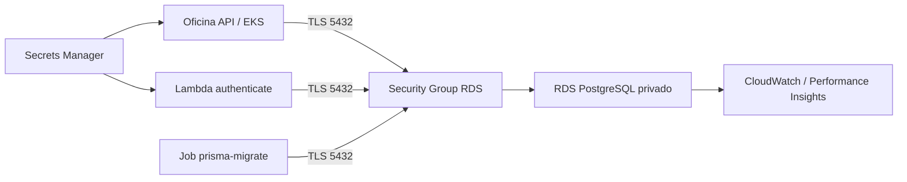

# Oficina Database Infrastructure

Infraestrutura Terraform independente para o Amazon RDS for PostgreSQL, incluindo acesso privado, credenciais, backups e monitoramento.

## O que este repositório entrega

- RDS PostgreSQL criptografado e sem endpoint público;
- DB Subnet Group em sub-redes privadas de duas AZs;
- Security Group restrito aos consumidores EKS/Lambda;
- segredo de conexão no AWS Secrets Manager;
- TLS com validação do bundle CA regional;
- backups, proteção de produção e parâmetros por ambiente;
- CloudWatch, logs do mecanismo, alarmes e Performance Insights;
- Terraform com state remoto e pipeline CI/CD.



## Documentação

- [Arquitetura, objetivos, decisões e limitações](docs/arquitetura-e-decisoes.md)
- [Estratégia de migrations](docs/migrations.md)
- [Governança do repositório](docs/governanca-repositorio.md)
- [Arquitetura integrada da solução](https://github.com/maypinheiro/oficina-api/blob/develop/docs/fase3/entrega-tecnica.md)
- [RFC do PostgreSQL/RDS](https://github.com/maypinheiro/oficina-api/blob/develop/docs/fase3/rfc-002-postgresql-rds.md)
- [Modelo de dados](https://github.com/maypinheiro/oficina-api/blob/develop/docs/fase3/modelo-dados.md)
- [Matriz completa de conformidade](https://github.com/maypinheiro/oficina-api/blob/main/docs/fase3/matriz-conformidade.md)
- [Catálogo de evidências](https://github.com/maypinheiro/oficina-api/blob/main/docs/fase3/catalogo-evidencias.md)

Repositórios relacionados: [API](https://github.com/maypinheiro/oficina-api), [autenticação](https://github.com/maypinheiro/oficina-auth-function) e [Kubernetes](https://github.com/maypinheiro/oficina-k8s-infra).

## Tecnologias

Terraform, Amazon RDS PostgreSQL, Secrets Manager, CloudWatch, Performance Insights, S3/DynamoDB para state e GitHub Actions.

## Validação local

```bash
terraform fmt -check -recursive
terraform init -backend=false
terraform validate
```

Um plan real requer os outputs de VPC/sub-redes/security groups e credenciais temporárias configuradas fora do Git.

## Ambientes

- `hml`: dados sintéticos, Single-AZ e retenção curta de backup;
- `prod`: state e banco independentes, backup ampliado, deletion protection e snapshot final;
- Multi-AZ permanece evolução condicionada ao orçamento acadêmico.

## CI/CD, migrations e rollback

CI valida formatação, Terraform, segurança e qualidade. CD aplica o banco depois da rede/EKS e antes das Functions/API. Migrations pertencem à API e rodam em Job Kubernetes antes do rollout, usando estratégia expand/contract. Rollback de imagem não reverte schema; state nunca é editado manualmente.

### Como executar o provisionamento

1. Obtenha VPC, sub-redes privadas e Security Groups do artefato do EKS.
2. Configure esses identificadores e o bundle CA oficial no GitHub Environment.
3. Abra **Actions → Provision Database → Run workflow** e escolha `hml` ou `prod`.
4. Revise o plan; o workflow aplica, aguarda `available` e comprova banco privado/criptografado e existência do secret.
5. Preserve `database-outputs-<env>-<sha>` para configurar API e Function.

O provisionamento é disparado automaticamente após CI verde: `homolog` utiliza `hml` e `main` utiliza `prod`. `workflow_dispatch` permanece como contingência, enquanto produção continua protegida pela aprovação do GitHub Environment; consulte a matriz de conformidade.

## Ambiente validado e limitações

Conta acadêmica `982623100545`, região `us-east-1`. A integração do banco privado foi validada por Lambda e API no fluxo E2E: <https://github.com/maypinheiro/oficina-auth-function/actions/runs/34617351925>.

Classes, Multi-AZ e algumas políticas podem ser limitadas pela `LabRole`, quotas e saldo. Credenciais AWS expiram ao final da sessão. O endpoint privado não é acessível diretamente da internet.
