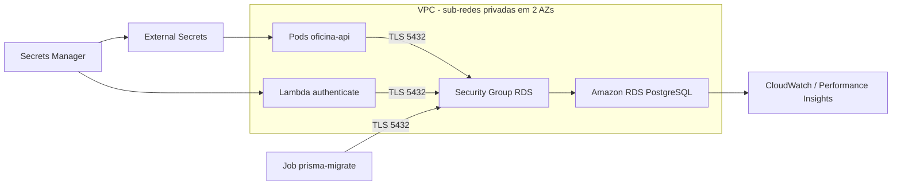

# Arquitetura e decisões técnicas

## Objetivo

Este repositório é o proprietário da persistência cloud da oficina. Ele provisiona PostgreSQL gerenciado, acesso privado, credenciais, backups e sinais operacionais sem acoplar o ciclo de vida do banco ao EKS ou à aplicação.

O schema é versionado no repositório da API e aplicado por um Job Kubernetes controlado. Terraform não executa migrations de negócio.

## Mapa de dados e acesso

## Recursos entregues

| Recurso | Finalidade |
|---|---|
| DB Subnet Group | Mantém o RDS em sub-redes privadas de duas AZs |
| Security Group | Libera 5432 somente aos security groups consumidores declarados |
| RDS PostgreSQL | Banco gerenciado, criptografado e sem endpoint público |
| Secrets Manager | Armazena host, porta, banco, usuário, senha e parâmetros TLS |
| Parameter/outputs | Publica apenas identificadores necessários aos pipelines consumidores |
| CloudWatch | Alarmes e logs do mecanismo |
| Performance Insights | Diagnóstico de carga e consultas, quando suportado pela classe |

## Decisões técnicas

### RDS fora do Kubernetes

Banco stateful dentro do EKS aumentaria risco operacional e não atenderia tão bem ao requisito de serviço gerenciado. RDS fornece backups, patching, métricas e ciclo de vida independente do cluster.

### PostgreSQL

PostgreSQL preserva compatibilidade com Prisma, migrations e modelo relacional já usados pela aplicação. Integridade referencial, transações e histórico de status da OS justificam a escolha relacional.

### Acesso privado por Security Group

`publicly_accessible` permanece falso. A porta 5432 aceita somente security groups associados ao EKS/consumidores e à Lambda de autenticação. Não existe regra pública por CIDR.

### TLS com CA da AWS

Clientes usam `sslmode=require`/configuração equivalente e validam o certificado com o bundle CA oficial da região `us-east-1`. O bundle é secret do GitHub Environment e não é armazenado no repositório.

### Credencial gerada e armazenada

Terraform gera a senha e grava o documento de conexão no Secrets Manager. Outputs nunca exibem senha ou conteúdo integral do secret. Rotações alteram a versão do segredo e provocam atualização dos consumidores.

### Migrations expand/contract

O CD da API executa `prisma migrate deploy` em Job único antes do rollout. Mudanças devem ser retrocompatíveis: primeiro expandir, depois migrar consumidores e somente então remover estruturas antigas.

## Ambientes e proteção

| Controle | `hml` | `prod` |
|---|---|---|
| Dados | Sintéticos | Isolados de homologação |
| Backup | Retenção curta, tipicamente 1 dia | Retenção de 7 dias |
| Multi-AZ | Desabilitado por custo acadêmico | Evolução condicionada ao orçamento |
| Deletion protection | Flexível para laboratório | Habilitada |
| Snapshot final | Configurável | Obrigatório antes de remoção |
| Terraform state | `database/hml/...` | `database/prod/...` |

## CI/CD

CI executa formatação, init sem backend, validate, segurança estática e qualidade. Após sucesso em `homolog`/`main`, o CD automático deriva `hml`/`prod`, faz checkout do SHA validado, lê os outputs de rede, aplica Terraform com state remoto e publica um artefato não sensível. `workflow_dispatch` permanece como contingência e `prod` mantém aprovação obrigatória.

Ordem: plataforma EKS/rede, banco, API/migrations e autenticação. O banco não deve ser recriado durante deploy normal da aplicação.

## Backup, rollback e desastre

- Rollback de aplicação não reverte automaticamente o schema.
- Antes de mudança destrutiva, criar snapshot e testar restauração.
- Falha de migration interrompe o rollout da API.
- Correções de infraestrutura são feitas por novo plan revisado, nunca por edição manual do state.
- Senha comprometida exige rotação do secret e reinício controlado dos consumidores.

## Observabilidade

CPU, memória, storage livre, conexões, latência e erros do mecanismo são acompanhados no CloudWatch e integrados ao Datadog. Alarmes não contêm SQL, CPF ou payloads sensíveis.

## Limitações do AWS Academy

- Conta `982623100545`, região `us-east-1` e permissões da `LabRole`.
- Algumas classes, versões e recursos como Multi-AZ podem estar indisponíveis ou exceder o orçamento.
- Credenciais AWS do pipeline expiram com a sessão do laboratório.
- O endpoint privado não pode ser testado diretamente da internet; validação ocorre por Lambda/EKS.
- Produção está codificada, mas homologação concentra a evidência acadêmica ativa.

## Evidência de integração

O RDS foi validado com TLS pela Lambda de autenticação e pela API no EKS. O fluxo E2E correspondente está registrado em <https://github.com/maypinheiro/oficina-auth-function/actions/runs/34617351925>.

## Rastreabilidade para avaliação

| Requisito | Implementação |
|---|---|
| Banco gerenciado | `main.tf` (`aws_db_instance`) |
| Banco privado | `publicly_accessible = false`, subnet group e Security Group em `main.tf` |
| Criptografia/credencial | KMS nativo do RDS e Secrets Manager em `main.tf` |
| Backups/proteção | Variáveis por ambiente e lifecycle do RDS |
| Monitoramento | `monitoring.tf` |
| Outputs seguros | `outputs.tf` sem senha |
| Migrations | Job da API e `docs/migrations.md` |
| CI/CD | `.github/workflows/ci.yml` e `cd.yml` |

Justificativa relacional e diagrama ER: <https://github.com/maypinheiro/oficina-api/blob/main/docs/fase3/modelo-dados.md>. Matriz completa: <https://github.com/maypinheiro/oficina-api/blob/main/docs/fase3/matriz-conformidade.md>.
